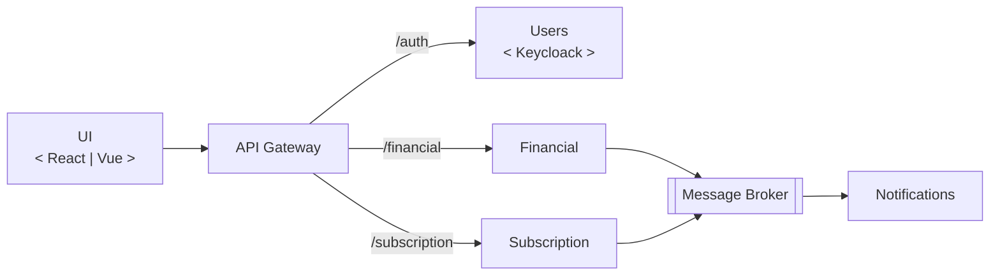

# app-coifa

A monorepo university work project of class "Advanced Techniques of Software Development" (original pt_BR: Técnicas Avançadas de Desenvolvimento de Software) 

## Application Architecture

The goal is develop an entire service oriented application following an architecure like the following:

## Development Status

Every microservice will use TypeScript and TypeScript ESLint

Service | Status | Description | Tech Stack
:- | :-: | :- | :-
UI | Not Started | Web application using a web components oriented framework | -
API Gateway | Not Started | - | - 
Users | Not Started | - | -
Financial | 1.0.0 | RESTful microservice that allows debit and credit | Express, Prisma.io
Subscription | Not Started | - | -
Message Broker | Not Started | - | -
Notifications | Not Started | - | -

## Packages and Microservices

This is only a short description, for more detailed information and usage refer to their README file

Package | Version | Description
:- | :-: | :-
eslint-config-typescript | 1.0.0 | Eslint configuration for every package
financial-service | 1.0.0 | Microservice that registers transferences from the user, shows history, allows to verify credit deposit transferences. Actually it only allows only credit deposits due to its system design
